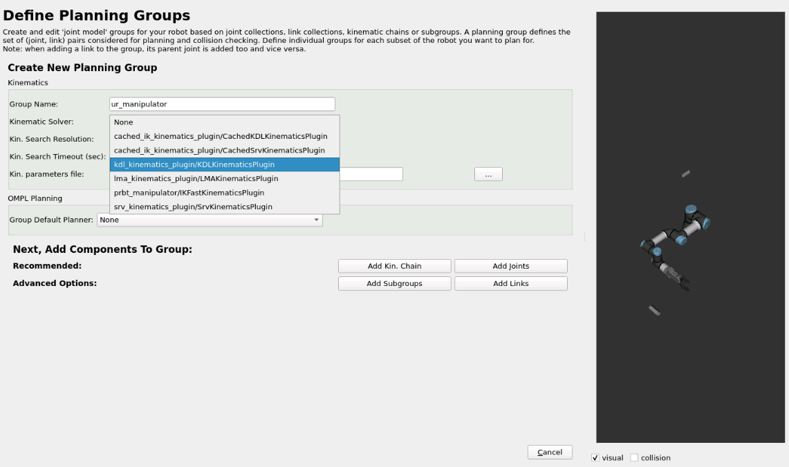
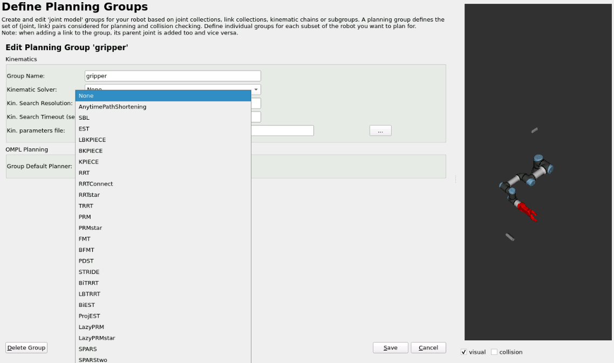
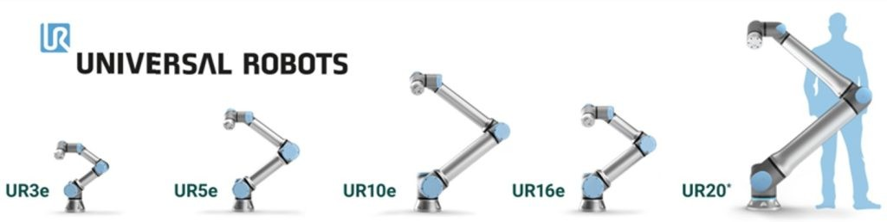

# robot_ur3e_setup

- [robot\_ur3e\_setup](#robot_ur3e_setup)
  - [Start Moveit in Simulation](#start-moveit-in-simulation)
    - [Separating move group and rviz](#separating-move-group-and-rviz)
  - [Start Moveit in Real Robot](#start-moveit-in-real-robot)
    - [Separating move group and rviz](#separating-move-group-and-rviz-1)
  - [Other configurations for the arm](#other-configurations-for-the-arm)
  - [Resources](#resources)

## Start Moveit in Simulation
```
cd ~/ros2_ws/ ;colcon build --packages-select sim_moveit_config;source install/setup.bash
ros2 launch sim_moveit_config run_moveit.xml
```
### Separating move group and rviz
```
cd ~/ros2_ws/ ;colcon build --packages-select sim_moveit_config;source install/setup.bash
ros2 launch sim_moveit_config move_group.launch.py
```
```
cd ~/ros2_ws/ ;source install/setup.bash
ros2 launch sim_moveit_config moveit_rviz.launch.py
```
## Start Moveit in Real Robot
```
cd ~/ros2_ws/ ;colcon build --packages-select real_moveit_config;source install/setup.bash
ros2 launch real_moveit_config run_moveit.xml
```
### Separating move group and rviz
```
cd ~/ros2_ws/ ;colcon build --packages-select real_moveit_config;source install/setup.bash
ros2 launch real_moveit_config move_group.launch.py
```
```
cd ~/ros2_ws/ ;source install/setup.bash
ros2 launch real_moveit_config moveit_rviz.launch.py
```

## Other configurations for the arm


```
ros2 launch moveit_setup_assistant setup_assistant.launch.py
```

## Resources
Orientation Constraint (doesn't work):
- https://moveit.picknik.ai/main/doc/how_to_guides/using_ompl_constrained_planning/ompl_constrained_planning.html
- https://docs.picknik.ai/en/4.0.1/how_to/application_how_tos/orientation_constrained_planning/orientation_constrained_planning.html

